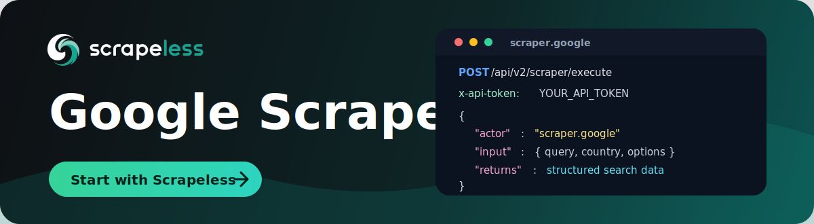

# Google Scraper

<p align="center">
  <a href="https://app.scrapeless.com/passport/login?redirect=/quick-start&utm_source=github&utm_medium=repo&utm_campaign=google-scraper" target="_blank">
    
  </a>
</p>

<p align="center">
  <a href="https://app.scrapeless.com/passport/login?redirect=/quick-start&utm_source=github&utm_medium=repo&utm_campaign=google_scraper">
    
  </a>
  <a href="https://www.scrapeless.com/en/blog?utm_source=github&utm_medium=repo&utm_campaign=google_scraper">
    
  </a>
  <a href="https://x.com/Scrapelessteam">
    
  </a>
  <a href="https://www.linkedin.com/company/scrapeless/">
    
  </a>
</p>

Collect structured **Google Search** results — organic web results, images, local
places, videos, and shopping — through the **Scrapeless Scraping API**, without
maintaining browsers, proxy pools, or your own anti-blocking stack.

Use this repo when you need a repeatable way to track keyword rankings, monitor
SERP features across locations and languages, collect image/video/shopping
results, or feed Google data into SEO, market-research, and automation workflows.

- **Full documentation:** https://apidocs.scrapeless.com/doc-800321 · https://apidocs.scrapeless.com/doc-1275927
- **Get your `x-api-token`:** https://app.scrapeless.com/passport/login?redirect=/quick-start
- **API endpoint:** `POST https://api.scrapeless.com/api/v1/scraper/request`

## How it works

Send a single `POST` request to the Scrapeless endpoint with your API token in
the `x-api-token` header. The body has two fields: `actor` (always
`scraper.google.search`) and an `input` object. The **`tbm`** field selects which
Google search vertical to scrape:

| `input.tbm` | Search vertical                          |
| ----------- | ---------------------------------------- |
| *(omitted)* | Web search (default).                    |
| `isch`      | Google Images.                           |
| `lcl`       | Google Local.                            |
| `vid`       | Google Video.                            |
| `shop`      | Google Shopping.                         |
| `nws`       | Google News.                             |

```http
POST https://api.scrapeless.com/api/v1/scraper/request
Content-Type: application/json
x-api-token: <YOUR_API_TOKEN>
```

Depending on how long the job takes, the API answers **synchronously** (`200`
with the data) or **asynchronously** (`201` with a `taskId` to fetch later). See
[Response & HTTP status codes](#response--http-status-codes) below.

## Quick start (curl)

```bash
curl 'https://api.scrapeless.com/api/v1/scraper/request' \
  --header 'Content-Type: application/json' \
  --header 'x-api-token: YOUR_API_TOKEN' \
  --data '{
    "actor": "scraper.google.search",
    "input": {
      "q": "coffee",
      "hl": "en",
      "gl": "us",
      "google_domain": "google.com"
    }
  }'
```

## Request parameters

The request body always has `actor` (`scraper.google.search`) plus an `input`
object. Only `q` is required.

| Parameter (`input.*`) | Required | Description                                                                                                                              |
| --------------------- | -------- | --------------------------------------------------------------------------------------------------------------------------------------- |
| `q`                   | Yes      | The search query. Supports Google operators (`inurl:`, `site:`, `intitle:`) and advanced query params.                                  |
| `hl`                  | No       | UI language code, e.g. `en`.                                                                                                            |
| `gl`                  | No       | Country code for the search, e.g. `us`.                                                                                                |
| `google_domain`       | No       | Google domain to query, e.g. `google.com`.                                                                                             |
| `location`            | No       | Where the search originates. City-level is recommended. Cannot be combined with `uule`.                                               |
| `uule`                | No       | Google-encoded location. Cannot be combined with `location`.                                                                          |
| `ludocid`             | No       | Google CID used to request a specific place / Knowledge Graph listing.                                                                 |
| `tbm`                 | No       | Search vertical: `isch` (images), `lcl` (local), `vid` (video), `shop` (shopping), `nws` (news). Omit for web search.                  |
| `tbs`                 | No       | Advanced filters (time range, sort, image/video/shopping filters). See [Advanced filters](#advanced-filters-tbs).                      |
| `start`               | No       | Result offset for pagination (`0` = page 1, `10` = page 2, …). Google Local accepts multiples of `20`.                                 |
| `num`                 | No       | Max number of results (default `10`). Larger values add latency; omit unless needed.                                                   |
| `device`              | No       | Device to emulate. Currently desktop only.                                                                                            |

## Search verticals

### Web (default)

```bash
curl 'https://api.scrapeless.com/api/v1/scraper/request' \
  --header 'Content-Type: application/json' \
  --header 'x-api-token: YOUR_API_TOKEN' \
  --data '{ "actor": "scraper.google.search", "input": {
      "q": "coffee", "hl": "en", "gl": "us", "google_domain": "google.com"
  }}'
```

### Images (`tbm=isch`)

```bash
curl 'https://api.scrapeless.com/api/v1/scraper/request' \
  --header 'Content-Type: application/json' \
  --header 'x-api-token: YOUR_API_TOKEN' \
  --data '{ "actor": "scraper.google.search", "input": {
      "q": "Apple Iphone16", "hl": "en", "gl": "us", "google_domain": "google.com", "tbm": "isch"
  }}'
```

### Local (`tbm=lcl`)

```bash
curl 'https://api.scrapeless.com/api/v1/scraper/request' \
  --header 'Content-Type: application/json' \
  --header 'x-api-token: YOUR_API_TOKEN' \
  --data '{ "actor": "scraper.google.search", "input": {
      "q": "Apple Iphone16", "hl": "en", "gl": "us", "google_domain": "google.com", "tbm": "lcl"
  }}'
```

### Video (`tbm=vid`)

```bash
curl 'https://api.scrapeless.com/api/v1/scraper/request' \
  --header 'Content-Type: application/json' \
  --header 'x-api-token: YOUR_API_TOKEN' \
  --data '{ "actor": "scraper.google.search", "input": {
      "q": "Coffee", "google_domain": "google.com", "start": 0, "num": 10, "tbm": "vid"
  }}'
```

### Shopping (`tbm=shop`)

```bash
curl 'https://api.scrapeless.com/api/v1/scraper/request' \
  --header 'Content-Type: application/json' \
  --header 'x-api-token: YOUR_API_TOKEN' \
  --data '{ "actor": "scraper.google.search", "input": {
      "q": "Coffee", "google_domain": "google.com", "start": 0, "num": 10, "tbm": "shop"
  }}'
```

> Google News is also supported with `tbm=nws`.

## Advanced filters (`tbs`)

The `tbs` parameter narrows results by time, sort order, and vertical-specific
filters. Combine multiple values with commas, e.g. `tbs=qdr:m,sbd:1`.

| Vertical            | Common `tbs` values                                       | Example                                        |
| ------------------- | --------------------------------------------------------- | ---------------------------------------------- |
| Web (default)       | `qdr` (h/d/w/m/y), `cdr` + `cd_min`/`cd_max`, `li`, `sbd`, `rltm` | `tbs=qdr:d,sbd:1` (past day, sorted by date)   |
| News (`nws`)        | `qdr`, `sbd`, `ar`                                        | `tbs=qdr:w` (news in the past week)            |
| Images (`isch`)     | `isz`, `islt`, `ic`, `itp`, `iar`, `sur`, `qdr`           | `tbs=isz:l,ic:trans` (large, transparent)      |
| Video (`vid`)       | `qdr`, `dur`, `vid`, `hq`, `cc`                           | `tbs=qdr:w,dur:m` (past week, medium length)   |
| Shopping (`shop`)   | `p_ord`, `mr`, `price` + `ppr_min`/`ppr_max`, `vw`, `sbd` | `tbs=mr:1,price:1,ppr_min:200,ppr_max:400`     |

You can also read a `tbs` value straight from a Google URL: apply filters in the
Google UI, then copy the `tbs=` value from the address bar. Full tables are in
the [official documentation](https://apidocs.scrapeless.com/doc-800321).

## Response & HTTP status codes

The Scraping API signals the outcome with the **HTTP status code**. Your client
should branch on it:

| Status | Name             | Meaning                                                                  | Example body                                        |
| ------ | ---------------- | ------------------------------------------------------------------------ | --------------------------------------------------- |
| `200`  | Success          | The scrape finished **synchronously**; the body **is** the SERP data.    | Vertical-specific JSON (organic / image / shopping results, etc.). |
| `201`  | Task In Progress | The job was accepted and is still **running asynchronously**.             | `{ "message": "task in progress", "taskId": "a8af123c-…" }` |
| `400`  | Bad Request      | The request could not be scraped.                                        | `{ "code": 20500, "message": "scraping failed" }`   |

**Handling `201` (async):** when you receive `201`, store the `taskId` and fetch
the result later (task-result polling / webhook callback) as described in the
[official documentation](https://apidocs.scrapeless.com/doc-1275927). A `200`
means the data is already in the response and no follow-up is needed.

For the full response schema of each vertical, see the
[official documentation](https://apidocs.scrapeless.com/doc-800321).

## Code examples

Ready-to-run examples live in [`examples/`](./examples). Each one selects the
search vertical via a command-line argument (defaults to `web`) and **branches on
the HTTP status code** (`200` / `201` / `400` / other):

| Language | File                                       | Run                                              |
| -------- | ------------------------------------------ | ------------------------------------------------ |
| Python   | [`example.py`](./examples/example.py)      | `pip install requests && python example.py images` |
| Node.js  | [`example.js`](./examples/example.js)      | `node example.js images` (Node 18+)              |
| Go       | [`example.go`](./examples/example.go)      | `go run example.go images`                       |
| Java     | [`Example.java`](./examples/Example.java)  | `java Example.java images` (Java 11+)            |
| PHP      | [`example.php`](./examples/example.php)    | `php example.php images`                          |

All examples read the token from the `SCRAPELESS_API_TOKEN` environment variable:

```bash
export SCRAPELESS_API_TOKEN="your_api_token"
```

Pass one of `web | images | local | video | shopping` as the argument to run a
different vertical.

## Practical use cases

### Keyword rank tracking

Scrape web results for your target keywords across languages (`hl`), countries
(`gl`), and locations to track organic rankings and SERP features over time.

### SEO and SERP monitoring

Monitor how titles, snippets, and result types change, and use `tbs` time filters
to focus on fresh content or specific date ranges.

### Shopping and price research

Use `tbm=shop` with price/sort filters (`tbs=mr:1,price:1,ppr_min:…,ppr_max:…`)
to collect product listings, prices, and sellers.

### Media and local intelligence

Collect image (`isch`), video (`vid`), and local (`lcl`) results to enrich
datasets, monitor brand presence, or analyze local packs.

## Why use Scrapeless for Google scraping?

| Benefit | What it means for your team |
| ------- | --------------------------- |
| One unified API | Web, images, local, video, shopping, and news through a single `scraper.google.search` actor. |
| Structured output | Clean JSON SERP data instead of raw HTML. |
| Less maintenance | No browser automation, proxy rotation, retries, or anti-blocking logic to build. |
| Localized results | Control language, country, and location with `hl`, `gl`, `location` / `uule`. |
| Sync or async | Get results inline (`200`) or via task id (`201`) for longer-running jobs. |

## FAQ

### What is Google Scraper?

Google Scraper is a Scrapeless Scraping API actor (`scraper.google.search`) that
returns structured Google Search results across verticals: web, images, local,
video, shopping, and news.

### How do I choose a search vertical?

Set `input.tbm`: omit it for web search, or use `isch` (images), `lcl` (local),
`vid` (video), `shop` (shopping), or `nws` (news). See
[Search verticals](#search-verticals).

### How do I filter by time, price, or image type?

Use the `tbs` parameter — see [Advanced filters](#advanced-filters-tbs). You can
also copy a ready-made `tbs` value from a Google URL after applying filters in
the UI.

### Why did I get a `201` instead of `200`?

`200` means the scrape completed synchronously and the body already contains the
data. `201` means the job is still running; keep the `taskId` and fetch the
result asynchronously as described in the docs.

### What does a `400` with `code: 20500` mean?

The request could not be scraped (`"scraping failed"`). Verify `q`, `tbm`, and
the other parameters, then retry.

### Do I need to run a browser or proxy pool?

No. Scrapeless handles the scraping workflow behind the API; your application
only sends requests and processes the returned data.

### What should I consider before using scraping in production?

Make sure your use case complies with applicable laws, platform terms, privacy
requirements, and your organization's data policies. Avoid collecting sensitive,
private, or unauthorized information.

## Learn more

- [Google Search API documentation](https://apidocs.scrapeless.com/doc-800321)
- [Async task / result documentation](https://apidocs.scrapeless.com/doc-1275927)
- [Scrapeless dashboard](https://app.scrapeless.com/passport/login?redirect=/quick-start)
- [Scrapeless website](https://www.scrapeless.com/en)

## Contact us

Need help building a Google SERP monitoring workflow or scaling data collection?

- Join our [Discord](https://discord.gg/VU2vtbq7Q2).
- Contact us on [Telegram](https://t.me/scrapeless).
- For repo-specific issues or improvements, open an issue or pull request in this repository.
